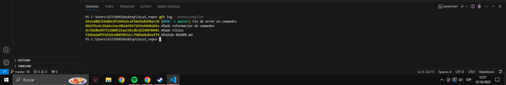
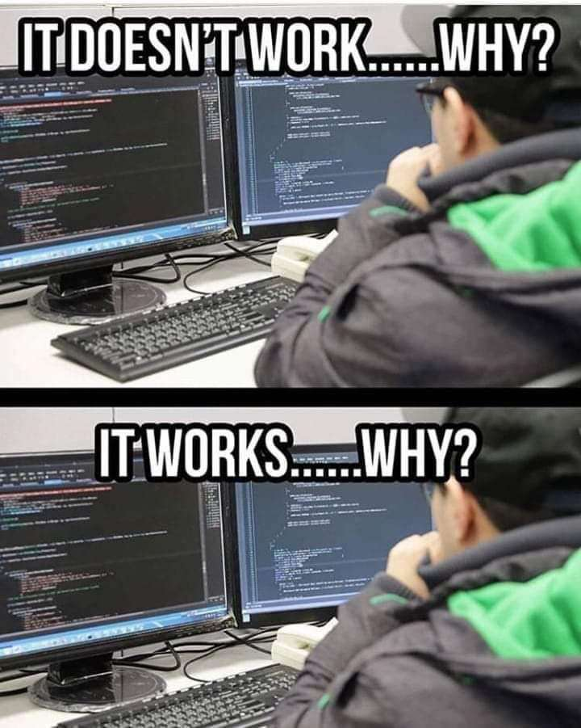

# Mi primer repo

Ejemplo para la practica 1

He añadido una imagen al proyecto!
<<<<<<< HEAD

=======
! [Mi log](GIT1.png)
>>>>>>> ab9ede99983618e9997750958ace561e757df2f7

## Ejemplos aparte

Añado un meme de prueba para practicar un poco Markdown
<<<<<<< HEAD

=======
! [ Meme](meme.jpg)
>>>>>>> ab9ede99983618e9997750958ace561e757df2f7
